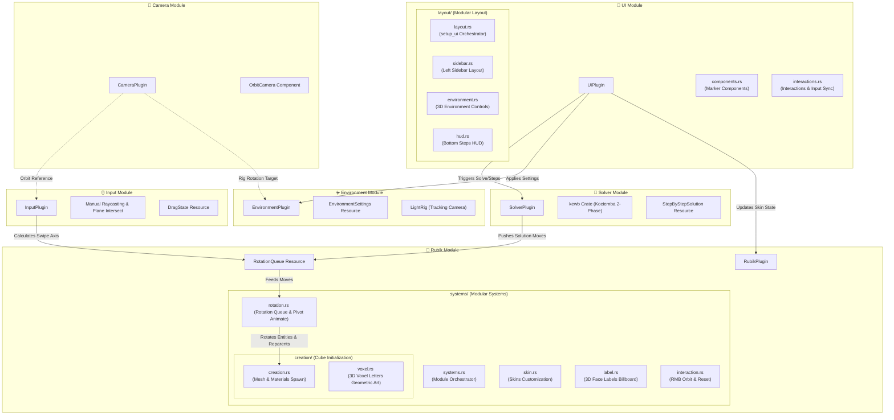

# 🏗️ Rubik's Cube ECS - Architectural Design Document

This document outlines the architectural patterns, math models, entity relationships, and ECS (Entity Component System) design choices implemented in the 3D Rubik's Cube game using **Bevy Engine (v0.18)** and **Rust**.

---

## 🧭 System Architecture Overview

The application is structured into decoupled, specialized modules, each registered as a self-contained Bevy `Plugin`. This modularity ensures a high degree of maintainability, isolating graphics rendering, input handling, and mathematical solving.

---

## 🧊 Core ECS Component & Resource Registry

The core design patterns of this application are represented cleanly in its components and resources.

### Key Components

| Component | Description | Location |
|:---|:---|:---|
| `RubikCube` | Marker component for the root transform containing all 27 cubies. | `rubik::components` |
| `Cubie` | Marker attached to individual 3D cubelets. | `rubik::components` |
| `GridCoord` | Contains logical `IVec3` coords in standard ranges `[-1, 0, 1]`. Used for state calculations. | `rubik::components` |
| `CubieFace` | Marker component containing a face direction (`Face`), attached to the individual 6-colored meshes of each cubie. | `rubik::components` |
| `Pivot` | Temporary parent entity spawned during slice rotation animations to rotate grouped cubies. | `rubik::components` |
| `TargetRotation` | Component carrying the target `Quat` to interpolate the pivot transformation smoothly. | `rubik::components` |
| `OrbitCamera` | Component carrying camera sphere orientation variables (`radius`, `alpha`, `beta`). | `camera::components` |

### Key Resources

| Resource | Description | Location |
|:---|:---|:---|
| `RotationQueue` | FIFO queue (`VecDeque<RotationMove>`) containing upcoming slice rotations. Decouples input/solver from animations. | `rubik::resources` |
| `CurrentlyRotating` | Active state of the animating slice (axis, index, timer progress, affected entity IDs). | `rubik::resources` |
| `MoveHistory` | Undo/Redo stacks (`done` and `undone` arrays) for keyboard shortcut commands (`Ctrl+Z`, `Ctrl+Y`). | `rubik::resources` |
| `RubikMaterials` | Standard matte materials for faces and loaded skin texture handles. | `rubik::resources` |
| `RubikSkin` | Current active skin selection (`Classic`, `Carbon`, `Geometric`, `Floral`). | `rubik::resources` |
| `EnvironmentSettings` | Real-time settings matching sliders (clear color, light intensities, warm/cool temperature). | `environment::resources` |
| `StepByStepSolution` | Current step index and calculated move strings generated from the automated solver. | `solver::resources` |

---

## 🔄 Module Breakdown

### 1. Rubik Core Module (`src/rubik`)
Manages structural rendering, mesh hierarchy, animation updates, and logical spatial tracking. Refactored from a large monolithic codebase into highly decoupled submodules under strict **Clippy standards**.
*   **Modular Architecture**:
    *   [mod.rs](file:///home/tchuong/M%C3%A0n%20h%C3%ACnh%20n%E1%BB%81n/Game_rubik/src/rubik/mod.rs): Registers `RubikPlugin` and handles resource initialization.
    *   [systems.rs](file:///home/tchuong/M%C3%A0n%20h%C3%ACnh%20n%E1%BB%81n/Game_rubik/src/rubik/systems.rs): The module entrypoint coordinating and re-exporting the systems.
    *   [systems/creation.rs](file:///home/tchuong/M%C3%A0n%20h%C3%ACnh%20n%E1%BB%81n/Game_rubik/src/rubik/systems/creation.rs): Spawns the central parent root, 27 cubies, colored facelets, and indicators.
    *   [systems/creation/voxel.rs](file:///home/tchuong/M%C3%A0n%20h%C3%ACnh%20n%E1%BB%81n/Game_rubik/src/rubik/systems/creation/voxel.rs): Contains geometric 3D voxel coordinates representing letters (`U`, `D`, `L`, `R`, `F`, `B`) and face color mappings.
    *   [systems/rotation.rs](file:///home/tchuong/M%C3%A0n%20h%C3%ACnh%20n%E1%BB%81n/Game_rubik/src/rubik/systems/rotation.rs): Manages the FIFO rotation queue and handles slice-rotation logic using Pivot entities.
    *   [systems/skin.rs](file:///home/tchuong/M%C3%A0n%20h%C3%ACnh%20n%E1%BB%81n/Game_rubik/src/rubik/systems/skin.rs): Applies custom textures or patterns dynamically.
    *   [systems/label.rs](file:///home/tchuong/M%C3%A0n%20h%C3%ACnh%20n%E1%BB%81n/Game_rubik/src/rubik/systems/label.rs): Matches the camera rotation to keep 3D face labels screen-aligned (billboard).
    *   [systems/interaction.rs](file:///home/tchuong/M%C3%A0n%20h%C3%ACnh%20n%E1%BB%81n/Game_rubik/src/rubik/systems/interaction.rs): Implements free 360-degree rotation (RMB) and orientation reset events.
*   **Cubie Generation**: Grid coordinate iteration spawns 27 cubies inside a central parent root entity. Colored stickers are spawned as children of the respective cubie transforms.
*   **Decoupled Slice Animation**:
    1.  When a slice move starts, a temporary `Pivot` entity is spawned at the center.
    2.  Affected cubies (sharing the target axis coordinate) are reparented to the `Pivot`.
    3.  A system interpolates the `Pivot`’s rotation `Quat` using an eased timer.
    4.  Once the animation finishes, the new positions and orientations are calculated, the cubies are reparented back to the root, and the `Pivot` is despawned.

### 2. Input & Picking Module (`src/input`)
Handles standard mouse clicking, camera control interception, and dragging gestures.
*   **Manual Raycasting**: Decoupled from massive heavy picking libraries, the system manually translates the viewport cursor screen coordinates into a world-space ray utilizing Bevy's camera transform (`viewport_to_world`).
*   **Plane Intersection**:
    *   Iterates through face entities, performing plane intersection.
    *   Finds the nearest facelet bounded to a `0.5` radius box.
    *   Stores hit coordinates on mouse drag initialization (`DragState`).
*   **Drag Vector Calculation**: On cursor release, projects the current cursor ray onto the plane of the initially clicked face. The resulting swipe vector dictates the orientation cross-product to determine which 3D axis is rotated.
*   **Center Protection constraint**: Rotations with `index == 0` (center slices) are explicitly blocked from mouse interaction to prevent axis-shifting disorientation, keeping controls extremely intuitive.

### 3. Solver Module (`src/solver`)
Bridges the physical 3D scene representation to the abstract mathematical two-phase algorithm.
*   **3D-to-Facelet State Mapping**:
    *   Maps each of the 6 core faces using orthogonal vector combinations (e.g. face normal vector, a right vector, and a down vector).
    *   Iterates through the 9 positions of each face.
    *   For each position, it searches for a cubie sticker whose global transform aligns with that exact spatial coordinate.
    *   Extracts the logical color (`Face`) and maps it to a standard 54-char string representation (`U...R...F...D...L...B`).
*   **Solver Interface**: Passes the facelet string into the `kewb` library which runs Kociemba's two-phase algorithm.
*   **Solution Pipeline**: Converts generated steps (e.g. `R2 U' F`) into sequenced `RotationMove` structs and queues them directly inside `RotationQueue`.

### 4. Camera & Environment Module (`src/camera` & `src/environment`)
Creates a high-end visual experience.
*   **Orbit Camera**: Tracks mouse movement when holding `Right-click`, modifying camera angles smoothly.
*   **Studio Light Tracking**: Features a dynamic lighting rig containing main, fill, and rim lights. The rig's rotation is updated relative to the camera vector, guaranteeing uniform illumination at any viewing angle.
*   **Reflection Plane & Shadows**: Renders a floor mesh configured to receive crisp soft shadows cast by the cube.

### 5. UI Module (`src/ui`)
Manages the graphical interface, widgets, customize sidebar, and step-by-step guidance HUD. Refactored from a monolithic codebase into a highly modular, decoupled structure satisfying strict **Clippy clean standards** (0 warnings, without using any `#[allow(clippy::too_many_lines)]` bypasses).
*   **Modular Architecture**:
    *   [mod.rs](file:///home/tchuong/M%C3%A0n%20h%C3%ACnh%20n%E1%BB%81n/Game_rubik/src/ui/mod.rs): Registers `UiPlugin` and sets up the resource flows.
    *   [components.rs](file:///home/tchuong/M%C3%A0n%20h%C3%ACnh%20n%E1%BB%81n/Game_rubik/src/ui/components.rs): Houses all ECS Marker Components (e.g. `CloseButton`, `ShuffleButton`, `EnvControl`) used to query and identify UI elements.
    *   [interactions.rs](file:///home/tchuong/M%C3%A0n%20h%C3%ACnh%20n%E1%BB%81n/Game_rubik/src/ui/interactions.rs): Contains systems that respond to user interactions (Hover, Click) by mutating internal resources (e.g., trigger solve pipeline, update background clear colors, or toggle skin materials).
    *   [layout.rs](file:///home/tchuong/M%C3%A0n%20h%C3%ACnh%20n%E1%BB%81n/Game_rubik/src/ui/layout.rs): The main setup entrypoint containing the `setup_ui` orchestrator which loads assets and builds the outer UI frame.
    *   [layout/sidebar.rs](file:///home/tchuong/M%C3%A0n%20h%C3%ACnh%20n%E1%BB%81n/Game_rubik/src/ui/layout/sidebar.rs): Spawns the modular Left Sidebar (including logo headers, basic button layouts, and collapsible skin options).
    *   [layout/environment.rs](file:///home/tchuong/M%C3%A0n%20h%C3%ACnh%20n%E1%BB%81n/Game_rubik/src/ui/layout/environment.rs): Spawns detailed panels for real-time 3D lighting, temperature presets, angle controls, and scene backdrops.
    *   [layout/hud.rs](file:///home/tchuong/M%C3%A0n%20h%C3%ACnh%20n%E1%BB%81n/Game_rubik/src/ui/layout/hud.rs): Spawns the bottom-anchored step-by-step guidance dashboard.
*   **Vector Rendering Excellence**: Uses the `bevy_resvg` framework to seamlessly render crystal-clear `.svg` vector icons into pixel-perfect Bevy UI meshes at runtime.
*   **Zero-Warning Clean Code**: Highly optimized visual spawning functions are aggressively divided into dedicated sub-functions (~30 to 60 lines each) to guarantee maximum code readability and strict Clippy pedantic compliance.

---

## 🧮 Mathematical Model & Transformations

To ensure consistent grid alignment throughout continuous rotations, the system updates entity coordinates mathematically using the following algorithms:

### 1. Slice Grid Coordination
Since 3D floating-point rotations accumulate precision errors over time, spatial locations are updated discretely on animation completion:

$$\vec{P}_{\text{new}} = \text{round}(R \cdot \vec{P}_{\text{old}})$$

Where $R$ is the $90^\circ$ rotation quaternion (`Quat::from_axis_angle`) and $\vec{P}$ is the logical `GridCoord` vector. Rounding guarantees that the coordinates are kept as precise integers (`-1`, `0`, or `1`).

### 2. Relative Face Orientation
Sticker rotation is applied dynamically to the individual mesh transformation matrices to ensure textures, skins, and face labels look visually authentic:

$$Q_{\text{new}} = Q_{\text{step}} \cdot Q_{\text{old}}$$

This allows children meshes to preserve their relative rotation histories correctly without drifting.
